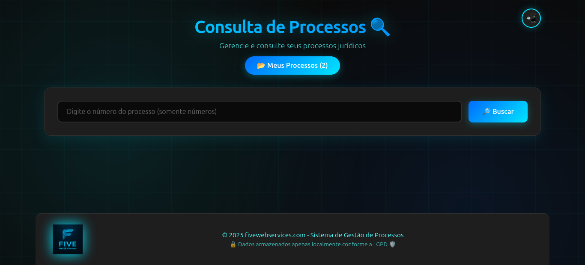

# 🔍 Sistema de Consulta a Processos Jurídicos# 🤖 

Aplicação para buscar, salvar e notificar movimentações de processos judiciais (integração principal com API DataJud do CNJ para TRT). Projetada para uso local com armazenamento no navegador e envio opcional de notificações via Telegram.



## Funcionalidades principais

- Buscar processos via API DataJud (atualmente disponível para TRT)
- Exibir movimentações do processo
- Salvar processos localmente (localStorage)
- Enviar resumo do processo para Telegram (configurável pelo usuário)
- lista de processos salvos e ações (enviar/excluir)

## ✨ Características

- 🔒 **100% LGPD Compliant** - Dados armazenados apenas no navegador do usuário.

- 📱 **Notificações via Telegram** - Configure seu próprio bot-telegram para envio de processos via telegram. 

- 🎨 **Interface Moderna** - Design responsivo e intuitivo.

- ⚡ **Performance** - Resposta em ~0.35s- Exibição de resultados em cards estilizados

- 🔄 **Busca em Tempo Real** - Integração com API pública para consulta de processos.

- 💾 **Armazenamento Local** - Sem banco de dados centralizado

## 🏗️ Arquitetura - gerenciamento de processos:


## Estrutura do projeto

- `backend/` - API Node.js (Express) e serviços (consulta DataJud, envio Telegram).
- `frontend/` - Aplicação React (Vite) com UI e gerenciamento local.
- `docker-compose.yml` - orquestração para rodar frontend + backend.


## Como rodar (local, com Docker)

```bash
docker-compose up -d --build
```

### Comandos Úteis

```bash
# Iniciar containers
docker-compose up -d

# Reconstruir após mudanças
docker-compose up -d --build

# Ver logs
docker-compose logs -f

# Parar containers
docker-compose down

# Limpar tudo
docker-compose down -v
```

### Limpar localStorage (para testes)

Abra o Console do navegador (F12) e execute:
```javascript
localStorage.clear();
location.reload();
```
3. Acesse o frontend: http://localhost:5173
   e a API backend: http://localhost:3001


## Endpoints úteis (resumo)

- `POST /processos/buscar` - busca um processo por número
- `POST /processos/enviar-resumo` - envia resumo via Telegram (requer configuração)
- `GET /processos/:numero` - obtém dados de um processo

## Observações

- A API pública do CNJ (DataJud) tem cobertura limitada — atualmente usada para TRT. Para outros tribunais, a disponibilidade varia.
- Dados do usuário são armazenados localmente no navegador, sem envio automático para servidores externos (a menos que o usuário use a função de envio para Telegram).

---

## 🛠️ Desenvolvimento

**Desenvolvido por:** fivewebservices.com

Desenvolvido para simplificar a consulta de processos jurídicos.
